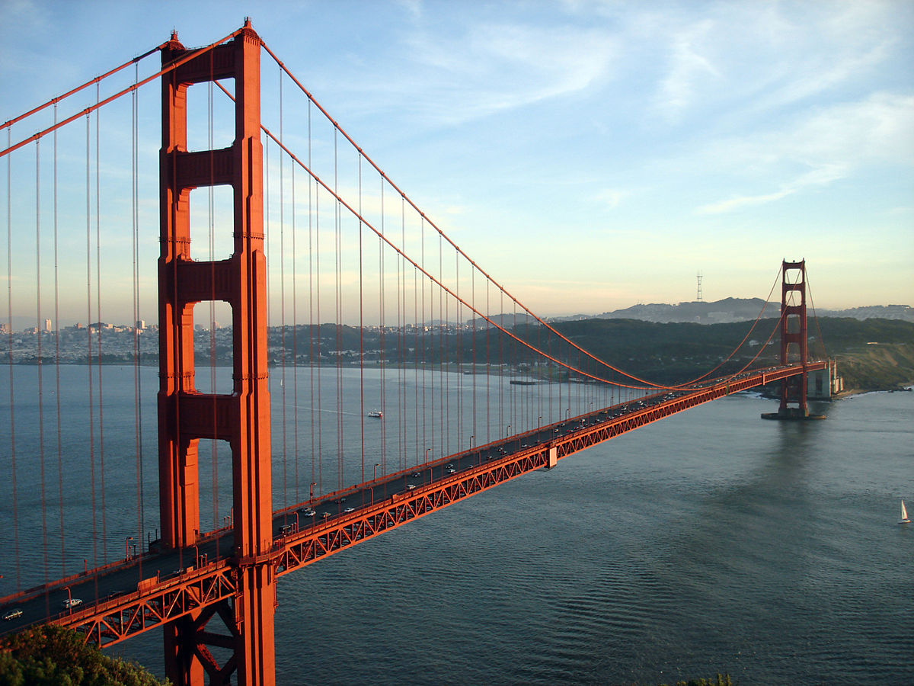
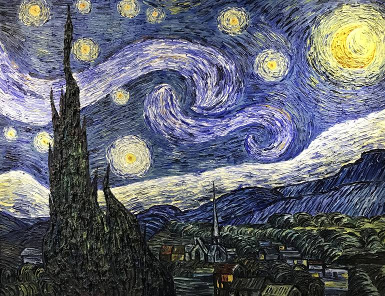

# Neural Style Transfer
The goal of this project is to implement the Neural Style Transfer (NST) Algorithm by [Gatys et al. (2015)](https://arxiv.org/abs/1508.06576) using TensorFlow 2.0.
> NST is an optimization technique used to take two images: a content image (C) and a style reference image (S) (such as an artwork by a famous painter) and blend them together so the output image (G) looks like the content image, but “painted” in the style of the style reference image.

## Tech used:
- TensorFlow 2.0.0
- Python 3.5.6

## Pre-Trained Models:
Following the original NST paper, the VGG19 network is used.
> This model has already been trained on the very large ImageNet database, and thus has learned to recognize a variety of low level features (at the shallower layers) and high level features (at the deeper layers).

## Instructions to run:
- Using `anaconda`:
  - Run `conda create --name <env_name> --file recog.yml`
  - Run `conda activate <env_name>`
- Using `pip`:
  - Run `pip install -r requirements.txt`
- Choose a `content_image` and a `style_image` from `images/samples` or take 2 RGB input images of your choice of dimensions approximately near 400x400 pixels
- `cd` to `src`
- Run `python main.py -cip <path_to_content_image> -sip <path_to_style_image>`

## Results:
Content Image: The Golden Gate Bridge

Style Image: Starry Nights by Vincent Van Gogh

Generated Image:

